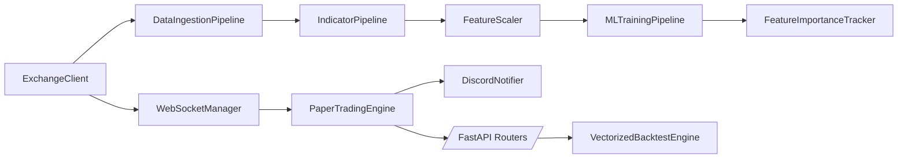
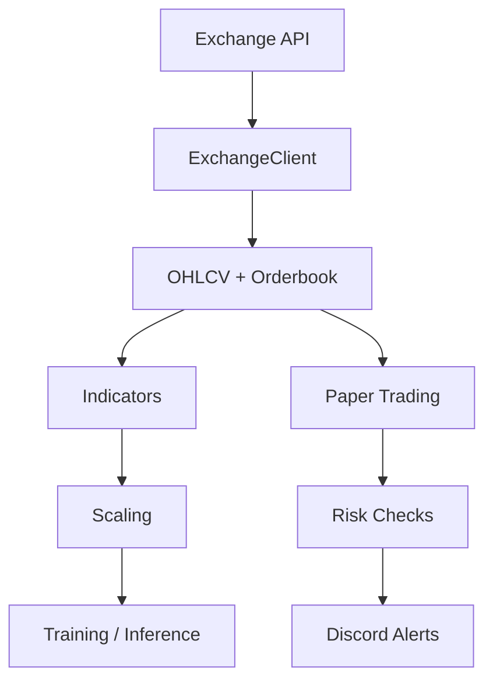

# External Library Integration Guide

## Quickstart

### 1) Exchange Connectivity (ccxt)

```python
from backend.ingest.exchange_client import ExchangeClient, ExchangeConfig, ExchangeType

client = ExchangeClient(ExchangeConfig(exchange_type=ExchangeType.BINANCE))
candles = await client.fetch_ohlcv("BTC/USDT", timeframe="1h", limit=200)
```

### 2) Vectorized Backtesting (vectorbt-compatible)

```python
import pandas as pd
from backend.sim.vectorized_engine import VectorizedBacktestEngine, VectorizedStrategy

class MyStrategy(VectorizedStrategy):
    def generate_signals(self, data: pd.DataFrame) -> pd.DataFrame:
        data = data.copy()
        data["entries"] = data["close"] > data["close"].rolling(20).mean()
        data["exits"] = data["close"] < data["close"].rolling(20).mean()
        return data

engine = VectorizedBacktestEngine(initial_cash=10_000)
result = engine.run(MyStrategy(), data)
```

### 3) Indicator Pipeline

```python
from backend.dataset.indicators import IndicatorPipeline, IndicatorConfig

pipeline = IndicatorPipeline(IndicatorConfig())
features = pipeline.compute(ohlcv_dataframe)
```

### 4) Freqtrade-Style Paper Strategies

```python
from backend.strategies.freqtrade_interface import ExampleSMAStrategy

strategy = ExampleSMAStrategy(fast_period=10, slow_period=30)
```

## API Reference

- `ExchangeClient.fetch_ohlcv(symbol, timeframe, since, limit)`
- `ExchangeClient.fetch_order_book(symbol, limit)`
- `ExchangeClient.fetch_ticker(symbol)`
- `ExchangeClient.fetch_trades(symbol, since, limit)`
- `TimeSynchronizer.system_to_exchange(timestamp)`
- `TimeSynchronizer.exchange_to_system(timestamp)`
- `WebSocketManager.connect(channels)` / `disconnect()`
- `IndicatorPipeline.compute(df)`
- `FeatureScaler.fit/transform/inverse_transform/save/load`
- `VectorizedBacktestEngine.run(strategy, data)`
- `VectorizedBacktestEngine.optimize(strategy, data, param_grid)`
- `PaperTradingEngine.get_risk_status()`
- `DiscordNotifier.send(category, component, message, metrics)`

## Migrations

### BinanceClient -> ExchangeClient

Old:

```python
from backend.ingest.binance_client import BinanceRestClient
client = BinanceRestClient()
bars = await client.get_klines("BTCUSDT", "1h", 100)
```

New:

```python
from backend.ingest.exchange_client import ExchangeClient, ExchangeConfig, ExchangeType
client = ExchangeClient(ExchangeConfig(exchange_type=ExchangeType.BINANCE))
bars = await client.fetch_ohlcv("BTC/USDT", "1h", limit=100)
```

### Legacy Strategy -> FreqtradeStrategy

Old:

```python
orders = strategy.on_bar(markets, portfolio)
```

New:

```python
df = strategy.populate_indicators(df)
df = strategy.populate_entry_trend(df)
df = strategy.populate_exit_trend(df)
```

### Manual Indicators -> IndicatorPipeline

Old:

```python
rsi = compute_rsi(close)
macd = compute_macd(close)
```

New:

```python
features = IndicatorPipeline().compute(ohlcv_df)
```

### SimEngine -> VectorizedBacktestEngine

Use `execution_mode=vectorized` on `/api/backtest/run` or instantiate
`VectorizedBacktestEngine` directly.

## Example Configurations

### Development

```env
APP_ENV=development
EXCHANGE_TYPE=binance
BACKTEST_EXECUTION_MODE=event_driven
INDICATOR_LIBRARY=auto
FEATURE_SCALER_TYPE=standard
```

### Production

```env
APP_ENV=production
EXCHANGE_TYPE=binance
EXCHANGE_ENABLE_RATE_LIMIT=true
DISCORD_WEBHOOK_URL=<secure-webhook-url>
DISCORD_RATE_LIMIT_PER_MINUTE=10
BACKTEST_EXECUTION_MODE=vectorized
```

## Known Limitations and Workarounds

- Vectorized API endpoint currently supports one market per request.
- `M3_DEPTH` requires populated bid/ask levels; fallback is `M2_BIDASK`.
- Exchange websocket URL builder is implemented for Binance; use `BinanceClient` or extend for others.
- SHAP importance is optional and degrades to safe fallback if SHAP is unavailable.

## Architecture Diagrams

### Component Interaction



### Data Flow


